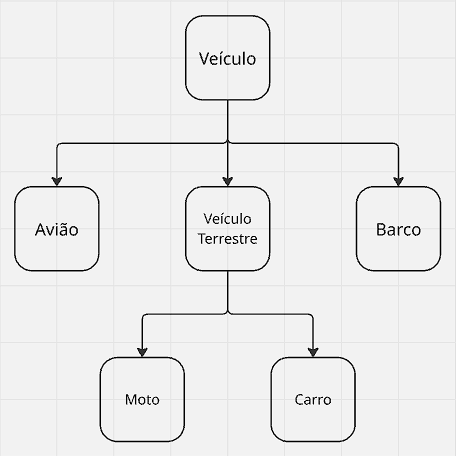

Neste arquivo faremos um breve resumo sobre os conceitos de Java básicos, conceitos específicos de cada lista serão introduzidos conforme a necessidade surgir

## Programação Orientada a Objetos

> [!WARNING]
> Aqui apenas introduziremos conceitos de Programação Orientada a Objetos sem a utilização de código, introduziremos Java mais abaixo neste arquivo

Para iniciar, precisamos definir a Programação Orientada a Objetos (POO), um paradigma de programação no qual tratamos nossos elementos de código como objetos reais [1]. A principal representação dessa ideia se dá pela dualidade Classe X Objeto, no qual classes representam ideias ou objetos com características e comportamentos comuns que servem como um modelo para a criação de objetos [1]. Por outro lado, objetos são instâncias de uma classe, uma entidade única e destacada daquela ideia.

Dessa forma, podemos observar a distinção entre classes e objetos por meio de um exemplo:

Considere que `Carro` é uma classe, uma ideia com características e comportamentos comuns, todos os objetos pertencentes a classe `Carro` possuem características como `motor`, `modelo`, `ano` e `número de assentos`. Por outro lado, o meu carro é objeto, deixando de ser uma ideia e passando a ser de fato uma instância, com `motor=1.6`, `modelo=Renault Logan`, `ano=2011` e `número de assentos=5`.

Quando tratando de comportamentos, entramos no que em Java são chamados de métodos. Todo carro deve ser capaz de acelerar, frear e buzinar, ao convertermos esse pensamento para nossa classe `Carro`, esses comportamentos se tornarão métodos, na forma `acelerar()`, `frear()` e `buzinar()`.

Outro grande benefício da orientação a objetos é o conceito de herança, que nos permite generalizar ou especializar classes de acordo com nossas necessidades, facilitando o reuso de código e garantindo consistência em implementações. Ainda em nosso exemplo anterior, podemos pensar que `Carro` na verdade é uma subclasse de uma classe maior, chamada `Veiculo`, que por sua vez é uma superclasse a qual engloba diferentes subclassesm como `Carro`, `Moto`, `Avião` e `Barco`, cada uma delas com diferenças entre si, mas também similaridades. Portanto, podemos armazenar tais similaridades na classe `Veiculo`, enquanto armazenamos suas especificidades na própria subclasse. Vale ressaltar que, a depender da sua necessidade, classes podem ser remodeladas para uma melhor adaptação ao seu problema, por exemplo, `Carro` e `Moto` poderiam não ser heranças diretas de `Veiculo`, mas sim de um intermediário `VeiculoTerrestre`, uma vez que os comportamentos e características compartilhados entre esses dois veículos são em parte muito similares, enquanto são distantes de `Avião` e `Barco`, por exemplo.

Dessa forma, nossa árvore de herança se tornaria:


## Conceitos Básicos de Java

Com os conceitos acima em mente, devemos começar a pensar em como implementá-los em Java ou qualquer linguagem que suporte orientação a objetos.

### A Linguagem Java

Para iniciar, Java é uma linguagem compilada, ou seja, seu código passará por um processo de pré-processamento para linguagem de máquina antes de ser executado [2], esse processo se dá por meio do Javac e da Java Virtual Machine (JVM) [3]. Javac será o responsável por compilar seu código e transformá-lo em bytecode, que será então interpretada em qualquer máquina pela JVM, algo fundamental no desenvolvimento Java e em muitas linguagens mais recentes, conhecido como Write once, run anywhere (WORA)[4], que permite o desenvolvimento de um único código para execução em dispositivos com arquiteturas e sistemas operacionais diferentes.

Com isso, para escrever e executar programas Java, lembre-se de instalar o [Java Development Kit (JDK)](https://www.oracle.com/java/technologies/downloads/). Para usuários Windows, também recomendo a instalação do [Windows Subsystem for Linux (WSL)](https://learn.microsoft.com/pt-br/windows/wsl/install), que irá facilitar sua vida ao integrar um sistema operacional Linux em seu computador sem a necessidade de um dual boot ou a migração total para Linux.

Para compilar seu código, utilize o comando:
```terminal
javac NomeDoArquivo.java
```

Com isso, será gerado um arquivo `NomeDoArquivo.class`, que pode ser executado com:
```terminal
java NomeDoArquivo
```

### Estrutura de um Aplicativo Java

Todo arquivo Java deve seguir a estrutura a seguir:

```java
public class NomeDoArquivo {
  // Implementação da classe
}
```

Ou seja, estando em um arquivo de nome `NomeDoArquivo.java`, apenas e obrigatóriamente devemos definir uma classe com modificador de acesso (explicado mais abaixo) `public` e com mesmo nome que o arquivo em que estamos, utilizando CamelCase.

Ademais, nossas classes devem, na maioria das vezes, permitir a criação de objetos, isso se dará por meio de um construtor, veremos sua definição voltando ao nosso exemplo com a classe `Carro`:

```java
public class Carro {
  private String modelo;
  private String motor;
  private int ano;
  private int numeroDeAssentos;
  
  // Construtor
  public Carro(String modelo, String motor, int ano, int numeroDeAssentos) {
    this.modelo = modelo;
    this.motor = motor;
    this.ano = ano;
    this.numeroDeAssentos = numeroDeAssentos;
  }
}
```

O construtor é um método especial, que tem o mesmo nome da classe e é utilizado para criar objetos, ou seja, instanciar a classe. No exemplo acima, o construtor recebe os parâmetros necessários para a criação de um objeto `Carro`, e os atribui às variáveis de instância da classe, utilizando a palavra-chave `this` para se referir à instância atual do objeto. Além disso, as variáveis da instância foram declaradas acima, no topo da nossa classe, sendo as características que desejamos que todos os objetos `Carro` tenham, ou seja, as características comuns a todos os carros.

Agora, falaremos um pouco sobre os modificadores de acesso, que são palavras-chave utilizadas para controlar a visibilidade e o acesso a classes, métodos e variáveis em Java. No exemplo acima, utilizamos o modificador `private` para as variáveis de instância, o que significa que elas só podem ser acessadas dentro da própria classe `Carro`, ou seja, não podem ser acessadas diretamente por objetos ou outras classes. Já o modificador `public` utilizado no construtor indica que ele pode ser acessado de qualquer lugar, permitindo a criação de objetos `Carro` a partir de outras classes. Tudo isso faz parte do conceito de encapsulamento, que é um dos pilares da programação orientada a objetos, e tem como objetivo proteger os dados e comportamentos de uma classe, controlando o acesso a eles por meio de modificadores de acesso.

Com isso, faz-se necessário a criação de métodos públicos para acessar e modificar as variáveis privadas, conhecidos como getters e setters, respectivamente. No exemplo da classe `Carro`, poderíamos criar um getter para a variável `modelo` da seguinte forma:

```java
public class Carro {
  private String modelo;
  private String motor;
  private int ano;
  private int numeroDeAssentos;
  
  // Construtor
  public Carro(String modelo, String motor, int ano, int numeroDeAssentos) {
    this.modelo = modelo;
    this.motor = motor;
    this.ano = ano;
    this.numeroDeAssentos = numeroDeAssentos;
  }

  // Getter para a variável modelo
  public String getModelo() {
    return this.modelo;
  }
}
```

Podemos ver outra característica da sintaxe Java acima, que é a definição do tipo de retorno do método, no caso `String`, também visto no tipo dos parâmetros do construtor, como `String modelo` e `int ano`. Java é uma linguagem de tipagem estática, ou seja, todas as variáveis e métodos devem ter seus tipos definidos em tempo de compilação, o que ajuda a evitar erros de tipo e a melhorar a legibilidade do código. Com isso, uma vez definido o tipo de uma variável ou método, ele não pode ser alterado, e qualquer tentativa de atribuir um valor de tipo diferente resultará em um erro de compilação.

De forma análoga, podemos criar um setter para a variável `modelo` da seguinte forma:

```java
public class Carro {
  private String modelo;
  private String motor;
  private int ano;
  private int numeroDeAssentos;
  
  // Construtor
  public Carro(String modelo, String motor, int ano, int numeroDeAssentos) {
    this.modelo = modelo;
    this.motor = motor;
    this.ano = ano;
    this.numeroDeAssentos = numeroDeAssentos;
  }

  // Getter para a variável modelo
  public String getModelo() {
    return this.modelo;
  }

  // Setter para a variável modelo
  public void setModelo(String modelo) {
    this.modelo = modelo;
  }
}
```

O objetivo da criação de getters e setters é permitir o acesso controlado às variáveis privadas, garantindo a integridade dos dados e permitindo a implementação de lógica adicional, como validação ou formatação, ao acessar ou modificar as variáveis. No exemplo acima, o getter `getModelo()` retorna o valor da variável `modelo`, enquanto o setter `setModelo(String modelo)` permite modificar o valor da variável `modelo` de forma controlada. Isso pode ser observado melhor ainda se fizermos o mesmo para a variável `ano`, onde o setter poderia ser implementado da seguinte forma:

```java
public class Carro {
  private String modelo;
  private String motor;
  private int ano;
  private int numeroDeAssentos;
  
  // Construtor
  public Carro(String modelo, String motor, int ano, int numeroDeAssentos) {
    this.modelo = modelo;
    this.motor = motor;
    this.ano = ano;
    this.numeroDeAssentos = numeroDeAssentos;
  }

  // Getter para a variável modelo
  public String getModelo() {
    return this.modelo;
  }

  // Setter para a variável modelo
  public void setModelo(String modelo) {
    this.modelo = modelo;
  }

  // Getter para a variável ano
  public int getAno() {
    return this.ano;
  }

  // Setter para a variável ano com validação
  public void setAno(int ano) {
    if (ano > 1885 && ano <= 2026) { // Validando o ano de fabricação do carro
      this.ano = ano;
    } else {
      System.out.println("Ano inválido para um carro.");
    }
  }
}
```

Com isso, o setter `setAno(int ano)` inclui uma validação para garantir que o ano de fabricação do carro seja válido, evitando a atribuição de valores que não fazem sentido para um carro, como anos muito antigos ou futuros.

Por fim, para finalizar nossa implementação da classe `Carro`, podemos adicionar os métodos de comportamento, como `acelerar()`, `frear()` e `buzinar()`, que podem ser implementados de forma análoga aos getters e setters:

```java
public class Carro {
  private String modelo;
  private String motor;
  private int ano;
  private int numeroDeAssentos;
  
  // Construtor
  public Carro(String modelo, String motor, int ano, int numeroDeAssentos) {
    this.modelo = modelo;
    this.motor = motor;
    this.ano = ano;
    this.numeroDeAssentos = numeroDeAssentos;
  }

  // Getter para a variável modelo
  public String getModelo() {
    return this.modelo;
  }

  // Setter para a variável modelo
  public void setModelo(String modelo) {
    this.modelo = modelo;
  }

  // Getter para a variável ano
  public int getAno() {
    return this.ano;
  }

  // Setter para a variável ano com validação
  public void setAno(int ano) {
    if (ano > 1885 && ano <= 2026) { // Validando o ano de fabricação do carro
      this.ano = ano;
    } else {
      System.out.println("Ano inválido para um carro.");
    }
  }

  // Método para acelerar o carro
  public void acelerar() {
    System.out.println("O carro está acelerando.");
  }

  // Método para frear o carro
  public void frear() {
    System.out.println("O carro está freando.");
  }

  // Método para buzinar o carro
  public void buzinar() {
    System.out.println("O carro está buzinando.");
  }
}
```

Agora, ao compilar esse arquivo `Carro.java`, e rodarmos `java Carro`... Não acontece nada, isso porque para executar um programa Java, precisamos de um método `main`, que é o ponto de entrada do programa, ou seja, o método que será executado quando rodarmos o programa. O método `main` deve ser definido da seguinte forma, usualmente, em uma classe separada, como `Main.java`, que será responsável somente pela execução do nosso aplicativo:

```java
public class Main {
  public static void main(String[] args) {
    Carro carro = new Carro("Civic", "1.0", 2020, 5);
    System.out.println(carro.getModelo()); // Escreve "Civic"
    carro.acelerar();
    carro.frear();
    carro.buzinar();
  }
}
```

O método `main` possui a assinatura `public static void main(String[] args)`, onde `public` indica que o método pode ser acessado de qualquer lugar, `static` indica que o método pertence à classe e não a uma instância específica (veremos isso com mais detalhes em listas futuras), `void` indica que o método não retorna nenhum valor, e `String[] args` é um array de strings que pode ser utilizado para receber argumentos da linha de comando. O método `main` deve existir em pelo menos uma classe do seu programa, e é o ponto de partida para a execução do programa, onde você pode criar objetos, chamar métodos e implementar a lógica do seu aplicativo, obrigatóriamente o método `main` deve seguir a assinatura descrita acima para ser detectado.

Além disso, vemos outras propriedades de Java no exemplo acima, como a criação de um objeto `Carro` utilizando o construtor definido anteriormente juntamente da palavra-chave `new`, e a chamada dos métodos `acelerar()`, `frear()` e `buzinar()` a partir do objeto `carro` criado e utilizando a notação de ponto para acessar os métodos do objeto.

## Conclusão
Com isso finalizamos a parte de revisão dos conceitos básicos de Java e sobre a criação de uma aplicação Java, siga para a lista 1 para começarmos a resolver exercícios e visualizar esses métodos em prática.

## Referências
[1] https://www.devmedia.com.br/conceitos-da-linguagem-java/5341
[2] https://medium.com/@MarianaSSABA/java-%C3%A9-uma-linguagem-compilada-ou-interpretada-16fcb04e60d3
[3] https://stackoverflow.com/questions/7674839/is-the-jvm-a-compiler-or-an-interpreter
[4] https://en.wikipedia.org/wiki/Write_once,_run_anywhere